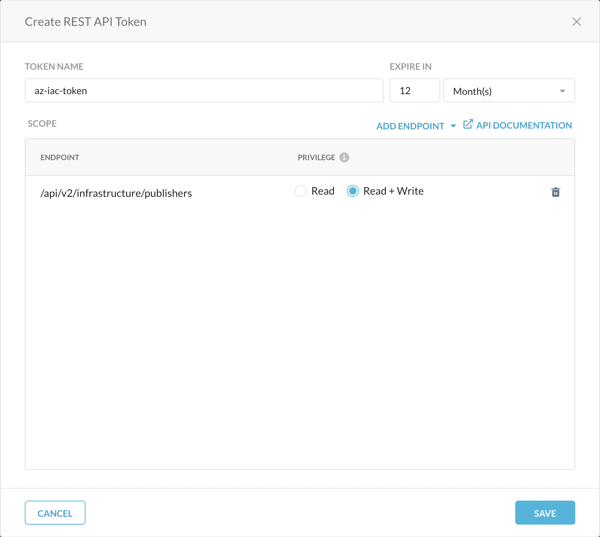

# Introduction

This Infrastructure as Code (IaC) will help you deploy Netskope Publisher in your Azure environment and configure the following;

- Create Netskope Publisher virtual machine into an existing virtual network, associate a System Assigned Managed AAD Identity and register the publisher with your netskope tenant.
- Create a storage account for boot diagnostics.
- Creates network security group with required rules and associate with the VM network interface. The network security rule is configure to allow communication to publisher shell access to the supplied trusted IP(s) i.e., ` var.trusted_ip `.
- Provides Netskope Publisher IP address as template output value.

## Key Points

- Ensure the outbound connectivity is allowed. For more information on the connectivity requirements: [Requirements](https://docs.netskope.com/en/deploy-a-publisher.html#UUID-7da4399d-5d95-5328-f08d-a954d5b49642_section-idm4547044674564832680183732553)

- The username must be set to "ubuntu". Password authentication is disabled and you must use SSH keys to authenticate.


Full documentation can be found here: [Netskope Publisher](https://docs.netskope.com/en/netskope-private-access.html)

## Architecture Diagram

This IaC will create the Azure resources as shown below.


*Fig 1. Netskope Publisher deployment in Azure*

## Deployment

To deploy this template in Azure:

- Identify the "Base URL" for your Netskope tenant. This is a URL that you use to access your Netskope tenant, for example: `https://example.goskope.com`

- Follow the [REST APIv2 Documentaion](https://docs.netskope.com/en/rest-api-v2-overview-312207.html) to create an API token.

    - Required "Read+Write" for `/api/v2/infrastructure/publisher` endpoint.



*Fig 2. Netskope Publisher Token*

- Clone the GitHub repository for this deployment.

- Configure provider block or set environment variables (recommended) for `NS_BaseURL` and `NS_ApiToken`. For example; 

   - For Provider Block.
   
    ```
      provider "netskope" {
        baseurl = "<tenant-url>"
        apitoken = "<api-token>"
      }
    ```

   - For Environment Variables.

   ```
      export NS_BaseURL=<tenant-url>
      export NS_ApiToken=<api-token>
   ```

- Customize variables in the `terraform.tfvars.example` and `variables.tf` file as needed and rename `terraform.tfvars.example` to `terraform.tfvars`.
- Change to the repository directory and then initialize the providers and modules.

   ```sh
   $ cd <Code Directory>
   $ terraform init
    ```
- Submit the Terraform plan to preview the changes Terraform will make to match your configuration.

   ```sh
   $ terraform plan
   ```
- Apply the plan. The apply will make no changes to your resources, you can either respond to the confirmation prompt with a 'Yes' or cancel the apply if changes are needed.

   ```sh
   $ terraform apply
   ```
- Output will provide Netskope Publisher ip address to access Netskope's Publisher Shell.

   ```sh
    Outputs:

    private_ip_address = <Publisher Private IP>

   ```

## Destruction

- To destroy this deployment, use the command:

   ```sh
   $ terraform destroy
   ```

## Support

Netskope-provided scripts in this and other GitHub projects do not fall under the regular Netskope technical support scope and are not supported by Netskope support services.